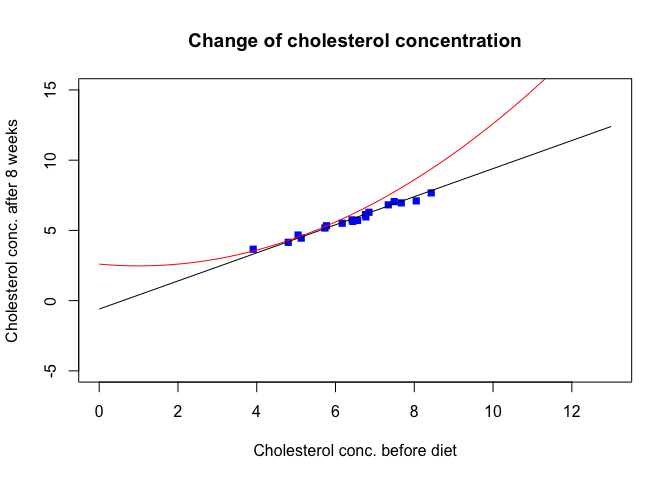
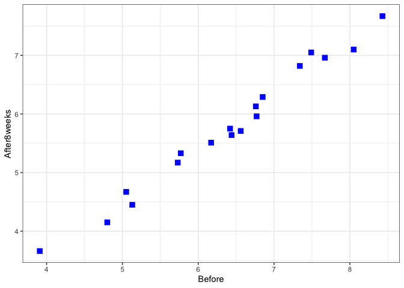
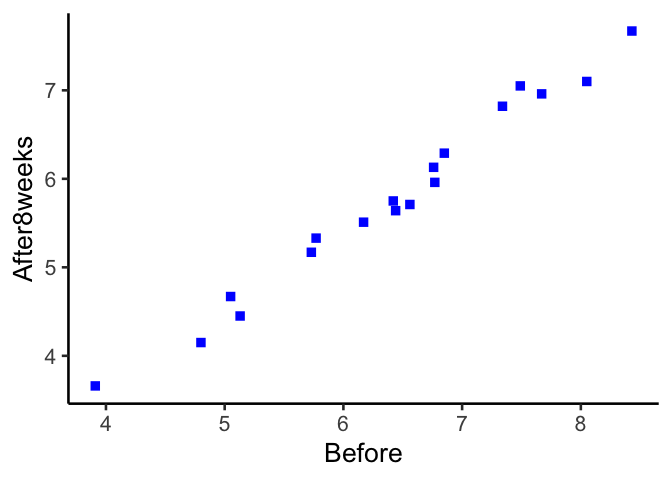
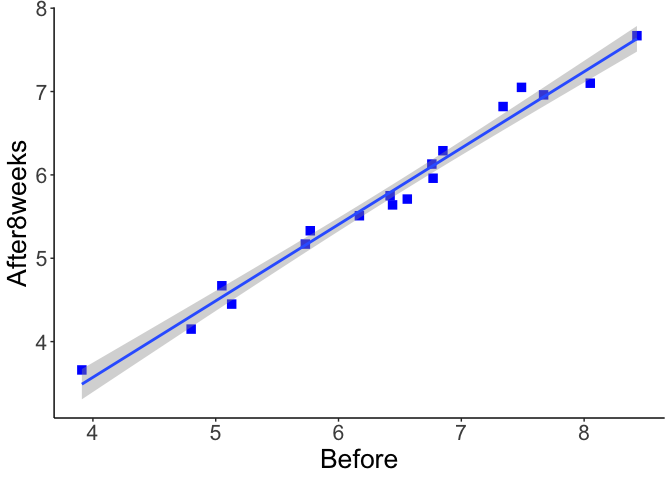
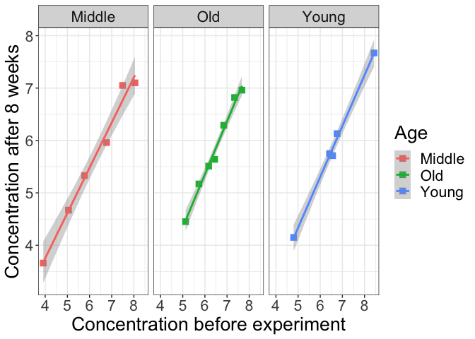

R PLOTTING - PART1
================
Szymon Drobniak
2021-07-05

<style type="text/css">
.bluef {
  color: blue;
}

.magf {
  color: magenta;
}
</style>

**In the below instructions…**

<span class="magf">**EXERCISE 1: **</span> are bits of code to
execute/practice pieces to do, often with only hints on how to perform
them.

<span class="bluef">**Output**</span> indicates the typical output you
should expect from a given instruction.

## Data

We will work on a simple dataset on cholesterol levels from patients.
The data presents cholesterol concentrations in plasma in patients
before diet, and after 4 & 8 weeks of diet containing one of two types
of margarine. The age group of patients is also indicated.

``` r
data_chol <- read.table('Cholesterol_Age_R.csv',
                       sep = ';', header = T,
                       stringsAsFactors = T)

head(data_chol)
```

    ##   ID Before After4weeks After8weeks Margarine AgeGroup
    ## 1  1   6.42        5.83        5.75         B    Young
    ## 2  2   6.76        6.20        6.13         A    Young
    ## 3  3   6.56        5.83        5.71         B    Young
    ## 4  4   4.80        4.27        4.15         A    Young
    ## 5  5   8.43        7.71        7.67         B    Young
    ## 6  6   7.49        7.12        7.05         A   Middle

``` r
summary(data_chol)
```

    ##        ID            Before       After4weeks     After8weeks    Margarine
    ##  Min.   : 1.00   Min.   :3.910   Min.   :3.700   Min.   :3.660   A:9      
    ##  1st Qu.: 5.25   1st Qu.:5.740   1st Qu.:5.175   1st Qu.:5.210   B:9      
    ##  Median : 9.50   Median :6.500   Median :5.830   Median :5.730            
    ##  Mean   : 9.50   Mean   :6.408   Mean   :5.842   Mean   :5.779            
    ##  3rd Qu.:13.75   3rd Qu.:7.218   3rd Qu.:6.730   3rd Qu.:6.688            
    ##  Max.   :18.00   Max.   :8.430   Max.   :7.710   Max.   :7.670            
    ##    AgeGroup
    ##  Middle:6  
    ##  Old   :7  
    ##  Young :5  
    ##            
    ##            
    ## 

## Formula notation

R modelling and graphing functions use a particular type of notation,
originating from the S-PLUS language, to represent relationships between
variables. Proportionality in this notation is indicated by `~`,
left-hand-side (LHS) of the formula contains dependent variables,
right-hand-side (RHS) independent. E.g., `y ~ x + z` may be used to
write down a relationship between a measured `y` variable and two
independent variables (`x` and `z`). Simple formulas (one LHS and one
RHS variable) are covenietnly used to assign variables to axes of a
plot.

## Simple R plot

First…

> *It is a myth that R is incapable of producing a final, publication
> quality (and pretty\!) plot that would not have to be modified
> afterwards :)*

To represent data graphically we have to asign it to the proper plot
axis. The simplest way of plotting data in R is by using a built-in
function `plot()`. Variables to plot can be supplied as its arguments,
respectively as **x** (horizontal axis) i **y** (vertical axis) - or by
supplying one argument, a formula, describing the relationship between
the dependent and independent variable, or in other words between x & y
as `y ~ x`. Have a look into `?plot()` to learn more. Note, that -
depending on the situation - you may have to provide just variable names
together with the name of the dataset - using `data = ...` - or to
directly call variables in your dataset (e.g. by using
`...$variable_x`).

<span class="magf">**EXERCISE 1: **</span>Try to recreate the below plot
using the loaded data. Consult the `plot()` function if necessary.

<span class="bluef">**Output**</span>
<!-- -->

<span class="magf">**EXERCISE 2: **</span> Modify the plot changing the
shapes and colours used on the plot (hints can be found here:
<https://www.r-graph-gallery.com/6-graph-parameters-reminder.html>).
Here I’m setting the symbols as blue squares.

<span class="bluef">**Output**</span>
<!-- -->

<span class="magf">**EXERCISE 3: **</span> The `plot()` function has the
`type` argument - try to see what this argument does. What happens if we
set it to `'n'`?

<span class="bluef">**Output**</span>
<!-- --><!-- --><!-- -->

Using the `type = 'l'` leads to a surprising problem - instead of an
expected zig-zag line connecting the points we gat a weird squiggly
bunch of loops. What should be done to the data to retrieve a proper
line plot, like the one below?

<span class="bluef">**Output**</span>
<!-- -->

## Using colours in R plots

<span class="magf">**EXERCISE 4: **</span> Colours and shapes on a plot
can be changed at will. Try to experiment in order to recreate the below
plot. Note: you have to creat your own data or input it directly into
the plotting function. Information about colour codes can be found here:
<http://derekogle.com/NCGraphing/resources/colors> - in summary, you can
choose them by indicating their names (e.g. `"hotpink"`) or specifying a
colour’s name in a hexadecimal number system (e.g. `"#AA6574"`).

<span class="bluef">**Output**</span>
<!-- --><!-- -->

## Assigning colours to variables

Apart from naming the colours directly - we can assign them to
particular values in our data. If data has values directly compatible
with R colours (i.e., integers from 1 to 9), they can be used directly
as colour identifiers.

<span class="magf">**EXERCISE 5: **</span> The below plot uses colours
to cod the age groups in our data - try to recreate this plot by linking
the `col` option to the relevant data variable. What key is ues to
choose specific colours on the plot?

<span class="bluef">**Output**</span>
<!-- -->

<span class="magf">**EXERCISE 6: **</span> If you would like to use
non-default colours here, you have to use the fact that levels o a
categorical variable in R (e.g., `AgeGroup`) are coded as integers, and
hence can be treated as indices selecting values from a vector of colour
names/codes:

<span class="bluef">**Output**</span>

``` r
plot(After8weeks ~ Before, data = data_chol,
xlab = "Cholesterol conc. before diet",
ylab = "Cholesterol conc. after 8 weeks",
main = "Change of cholesterol concentration",
pch = 15, col = c('pink', 'chartreuse', 'brown')[data_chol$AgeGroup])
```

<!-- -->

-----

## Histogram

Histogram is a useful and frequently used type of plot - it can be
generated using the `hist()` function.

<span class="magf">**EXERCISE 7: **</span> Create a histogram of 50
ranom samples from a normal distribution with mean 20 and standard
deviation 4 (you may want to use the following call `rnorm(50, 20, 4)`).
<span class="bluef">**Output**</span>
<!-- -->

Histogram does not have one colour parameter - each rectangle has a
border and its filling. Consulting `?hist()` check how to reproduce the
below version of a histogram.

<span class="bluef">**Output**</span>
<!-- -->

<span class="magf">**EXERCISE 8: **</span> Redo the histogram by
increasing the number of binning intervals.
<span class="bluef">**Output**</span> (example)
<!-- -->

<span class="magf">**EXERCISE 9: **</span> instead of a histogram,
distributional data can be presented using a smoothed density of data
(*kernel density*). You can use the built-in function `density()` to
produce such curve, and it can be overlaid on an existing plot using the
`lines()` function (similarly, to the `points()` function overlaying
points, the `lines()` function does not create a new plot but adds lines
to an existing plot ). Try to recreate the above histogram adding to it
an overlaid density line: <span class="bluef">**Output**</span>
(example) <!-- -->

## Setting non-graphical parameters

R plots generated by the basic function can be modified in many ways, to
adjust their appearance to particular needs. A number of parameters can
be set inside the `plot()` function, but others can be set using a
special `par()` function.

<span class="magf">**EXERCISE 10: **</span> The plotting area can be
modified by setting the limits of the axes - to achieve this modify the
`ylim` and `xlim` arguments, they take vectors of length 2 as values.
<span class="bluef">**Output**</span>
<!-- -->

Such option becomes especially useful when plotting custom curves, that
need to be displayed in some speciic range. Compare the two below plots:

``` r
plot(After8weeks ~ Before, data = data_chol,
xlab = "Cholesterol conc. before diet",
ylab = "Cholesterol conc. after 8 weeks",
main = "Change of cholesterol concentration",
pch = 15, col = "blue")

curve(-0.6 + x, add = T)
curve(2.6 - 0.25*x + 0.125*x^2, add = T, col = 'red')
```

<!-- -->

``` r
plot(After8weeks ~ Before, data = data_chol,
xlab = "Cholesterol conc. before diet",
ylab = "Cholesterol conc. after 8 weeks",
main = "Change of cholesterol concentration",
pch = 15, col = "blue",
xlim = c(0, 13), ylim = c(-5, 15))

curve(-0.6 + x, add = T)
curve(2.6 - 0.25*x + 0.125*x^2, add = T, col = 'red')
```

<!-- -->

<span class="magf">**EXERCISE 11: **</span> Try applying similar
modification to our final histogram, to avoid automativ selection of
x-axis ends (which slightly misses the limits o actual data).

<span class="bluef">**Output**</span> (example)
<!-- -->

<span class="magf">**EXERCISE 12: **</span> The plotting function
options can also be used to change the type of axes to logged - we can
achieve this in two ways, resulting in two different ways of
presentation. The simplest is to use the `log` option in the `plot()`
function: <span class="bluef">**Output**</span>

``` r
plot(After8weeks ~ Before, data = data_chol,
xlab = "Cholesterol conc. before diet",
ylab = "Cholesterol conc. after 8 weeks",
main = "Change of cholesterol concentration",
pch = 15, col = "blue", log = "x")
```

<!-- -->

However, you can also directly log the data while plotting it (how would
you achieve this?). <span class="bluef">**Output**</span>
<!-- -->

The plots look similar - but there is one fundamental difference - what
is it? What type of log was used in these plots?

<span class="magf">**EXERCISE 13: **</span> In order to modify plot
parameters such as its margins - we have to use the `par()` function,
and we should modify specific parameters in it. Be aware, that the
setting chosen will affect any future plot produced in a given session
of R. Try using the `mai` option (which specifies distances in inches)
or `mar` option (which specify distances in lines of text) to change the
plot margins (each of these options takes a vector with 4 elements, the
margins of bottom, left, top and right edge). The below picture
demonstrates how the margin parameters are interpreted with respect to a
plotting area:


<span class="bluef">**Output**</span>
<!-- -->

If at any stage you use the `par()` function and loose track of what
parameters have been modified and which haven’t (or - another function
happens to modify some graphical parameters beyond your control) you can
easily reset the plotting standard output to the default graphical
parameters. Just run:

``` r
dev.off()
```

which will close and reset the active (screen) plotting output.

## Using `ggplot2` - introduction

Control over the graphical parameters in the `plot()` function is
rudimentary. The **ggplot2** package gives much more control over how
the plots are made and built. The **ggplot2** package is based on so
called graphics grammar, a set of rules describing the visual appearance
of a plot:

  - linking of data to specific elements of a plot (so called
    **mapping**) is separated from its actual appearance (i.e.,
    **aesthetics**);
  - the plot has a layered structure, with latter elements appearing on
    top of the former ones;
  - if possible all plot elements should be built on the go, inside of
    the plotting code, without the need of modifying/transforming the
    original data.

A simple *ggplot2* graph may be structured as follows:

``` r
mygraph <- ggplot2(data = MYDATA,
                  mapping = aes(x = VAR1, y = VAR2, ...)) +
  geom_1(OPTIONS) +
  geom_2(OPTIONS)

plot(mygraph)

graph2 <- mygraph + geom_3
plot(graph2)
```

Calling the `ggplot()` function may be used only to create an object of
class `ggplot`, without displaying the actual graph. Such object will
contain the data and its mappings to specific elements of the final
plot. To display it, we need additional function from the `geom_...`
family, which add specific visual elements to the defined mappings (e.g.
`geom_point` adds scatterpoints, `geom_hist` forms a histogram).
Subsequent elements can be concatenated using the `+` operator. other
elements that can be added to the plot using `+` are display and
aesthetic rules, e.g. `theme()`, which describe the appearance of
non-data elements of a plot.

Load the `ggplot2` - if you don;t have it use `install.packages()` to
install it.

``` r
# install.packages('ggplot2')
library(ggplot2)
```

## `ggplot2` scatterplot

<span class="magf">**EXERCISE 14: **</span> Make a scatterplot similar
to one of the previous excersises, mapping the concentrations of
cholesterol on the x and y axes. Use blue squares as points. You may
want to use the `cex` option to increase the default symbol size (`cex`
defines a multiplicative coefficient, that increases or decreases plot
elements given number of times).

<span class="bluef">**Output**</span>
<!-- -->

<span class="magf">**EXERCISE 15: **</span> Let’s improve the plot by
removing the annoying gray background. add the `theme_...()` call to the
plot (you can review different predefined versions of it here
<https://ggplot2.tidyverse.org/reference/ggtheme.html>) to produce a
cleaner graph. <span class="bluef">**Output**</span>

<!-- -->

<span class="magf">**EXERCISE 16: **</span> An even more
aesthetically-pleasing plot can be produced using the “classic” theme.
Try also, by addind the `theme()` definition to the plot, to modify the
`text` element using the following formatting: `element_text(size = 20)`
- which should increase the default font sizing).
<span class="bluef">**Output**</span>
<!-- -->

<span class="magf">**EXERCISE 17: **</span> Add the `geom_smooth`
aesthetic to the plot, selecting the `lm` method as its option. Do you
know what does `lm` indicate? <span class="bluef">**Output**</span>

    ## `geom_smooth()` using formula 'y ~ x'

<!-- -->
<span class="magf">**EXERCISE 18: **</span> Modify the above call to
change the appearance of the regression line.
<span class="bluef">**Output**</span>

    ## `geom_smooth()` using method = 'loess' and formula 'y ~ x'

<!-- -->

## Annotating the plot, other dimensions of data

<span class="magf">**EXERCISE 19: **</span> Try to map the age groups
(`AgeGroup`) to the graph points’ colours. Using the `alpha` option
(taking values 0 - 1 - which indicates the transparency of the
regression error band) I decreased the cluttered appearance of the plot,
making the error bands a bit more subtle.
<span class="bluef">**Output**</span>

    ## `geom_smooth()` using formula 'y ~ x'

<!-- -->

<span class="magf">**EXERCISE 20: **</span> let’s add the `labs()` layer
with a bit more readable axes names.
<span class="bluef">**Output**</span>

    ## `geom_smooth()` using formula 'y ~ x'

<!-- -->
<span class="magf">**EXERCISE 21: **</span> An alternative way of coding
age gropups - instead of mapping it to colours - may be splitting the
groups by so called *facets*, which presents subsets of data on separate
subplots using a common scale. To achieve this you should use the
`facet_wrap()` function, which takes a formula of the form `~ A`, where
A indicates a variable from the dataset that defines the split of the
graph area into subplots. (An analogous function `facet_grid()` handles
well two-sided formulas `A ~ B` that define a grid of plots). Try to
recreate the below plot - it may look better with the `theme_bw()`
style, instead of the "classic’ one.
<span class="bluef">**Output**</span>

    ## `geom_smooth()` using formula 'y ~ x'

<!-- -->

## `ggplot2` histogram

<span class="magf">**EXERCISE 22: **</span> Using the `geom_hist()`
geometry create a histogram of the `After8weeks` variable.
<span class="bluef">**Output**</span>
<!-- -->

<span class="magf">**EXERCISE 23: **</span> Change the histogram so that
it displays relative frequencies of data in each bin, and not absolute
counts. Inspiration on how to do this can be found here:
<https://homepage.divms.uiowa.edu/~luke/classes/STAT4580/histdens.html>
- there are at least two ways of achieving this goal\!

<span class="bluef">**Output**</span>
<!-- -->

<span class="magf">**EXERCISE 24: **</span> Modify the histogram to add
a kernel density estimator to it (it is an analogue of the `density()`
function we have used earlier).

<span class="bluef">**Output**</span>
<!-- -->

-----

-----

## ADDITIONAL EXERCISES

1.  `geom_boxplot()` can be used to visualise categorical data. In base
    R this is achieved by using the `boxplot()` function:

<!-- end list -->

``` r
boxplot(Before ~ AgeGroup, data = data_chol,
        xlab = "Age group", ylab = "Cholesterol conc. before the experiment")
```

<!-- -->

Try to produce such plot, showing the cholesterol concentrations before
the diet, categorised by age groups, in `ggplot2`. Use `?geom_boxplot`
and if needed the book <https://ggplot2-book.org> to find out how to
achieve this. On such boxplot - what is the meaning of: the boundaries
of each box, the ends of the whiskers and the additional points added to
the plot?

<!-- -->

2.  A boxplot may be much more informative if we add raw data to it. It
    can be done in many ways - e.g., to achieve an effect similar to
    this one; <https://bit.ly/31estrN>. Try to produce a similar plot
    using additional data (file `Diet_R.csv`, which presents weight loss
    of patients on three different diets). Before using the data clean
    it from all missing values (`na.omit()`).

<!-- -->
