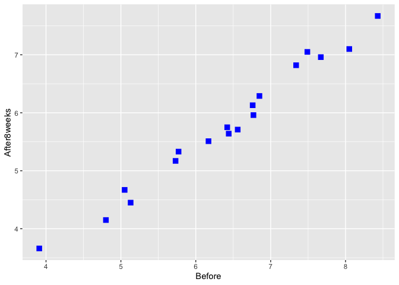
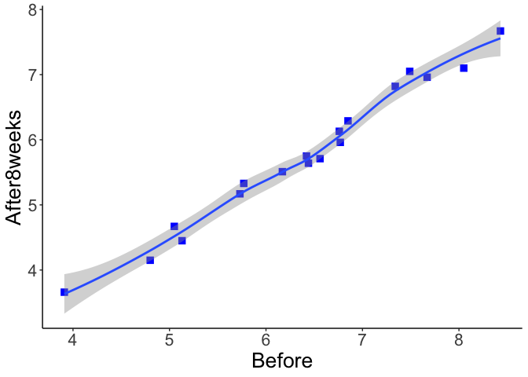
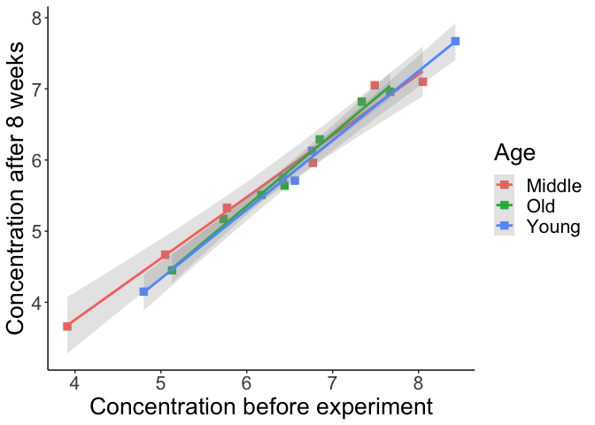
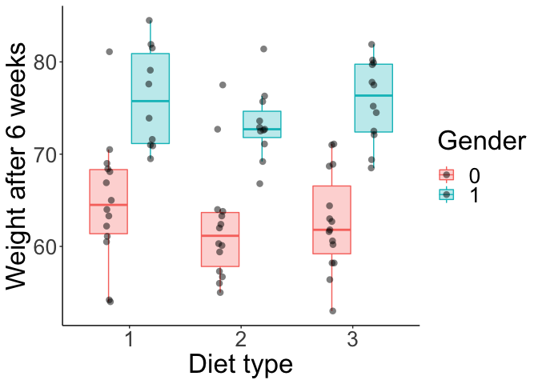

-   [Class 12](#class-12)
    -   [Data](#data)
    -   [`ggplot2` scatterplot](#ggplot2-scatterplot)
    -   [Annotating the plot, other dimensions of
        data](#annotating-the-plot-other-dimensions-of-data)
    -   [`ggplot2` histogram](#ggplot2-histogram)
    -   [Boxplot](#boxplot)
    -   [Saving the plots](#saving-the-plots)

Class 12
========

**In the below instructions…**

**EXERCISE 1:** are bits of code to execute/practice pieces to do, often
with only hints on how to perform them.

**Output** indicates the typical output you should expect from a given
instruction.

Data
----

We will work on a simple dataset on cholesterol levels from patients.
The data presents cholesterol concentrations in plasma in patients
before diet, and after 4 & 8 weeks of diet containing one of two types
of margarine. The age group of patients is also indicated. Data can be
downloaded here:
<a href="https://raw.githubusercontent.com/wbabik/Practical_computing/teaching/Class_10/data/Cholesterol_Age_R.csv" class="uri">https://raw.githubusercontent.com/wbabik/Practical_computing/teaching/Class_10/data/Cholesterol_Age_R.csv</a>

``` r
data_chol <- read.table('https://raw.githubusercontent.com/wbabik/Practical_computing/teaching/Class_10/data/Cholesterol_Age_R.csv',
                       sep = ';', header = T,
                       stringsAsFactors = T)

head(data_chol)
```

    ##   ID Before After4weeks After8weeks Margarine AgeGroup
    ## 1  1   6.42        5.83        5.75         B    Young
    ## 2  2   6.76        6.20        6.13         A    Young
    ## 3  3   6.56        5.83        5.71         B    Young
    ## 4  4   4.80        4.27        4.15         A    Young
    ## 5  5   8.43        7.71        7.67         B    Young
    ## 6  6   7.49        7.12        7.05         A   Middle

``` r
summary(data_chol)
```

    ##        ID            Before       After4weeks     After8weeks    Margarine
    ##  Min.   : 1.00   Min.   :3.910   Min.   :3.700   Min.   :3.660   A:9      
    ##  1st Qu.: 5.25   1st Qu.:5.740   1st Qu.:5.175   1st Qu.:5.210   B:9      
    ##  Median : 9.50   Median :6.500   Median :5.830   Median :5.730            
    ##  Mean   : 9.50   Mean   :6.408   Mean   :5.842   Mean   :5.779            
    ##  3rd Qu.:13.75   3rd Qu.:7.218   3rd Qu.:6.730   3rd Qu.:6.688            
    ##  Max.   :18.00   Max.   :8.430   Max.   :7.710   Max.   :7.670            
    ##    AgeGroup
    ##  Middle:6  
    ##  Old   :7  
    ##  Young :5  
    ##            
    ##            
    ## 

`ggplot2` scatterplot
---------------------

``` r
library(ggplot2)
```

**EXERCISE 1:** Make a scatterplot similar to one of the previous
excersises, mapping the concentrations of cholesterol on the x and y
axes. Use blue squares as points. You may want to use the `cex` option
to increase the default symbol size (`cex` defines a multiplicative
coefficient, that increases or decreases plot elements given number of
times).

**Output**



**EXERCISE 2:** Let’s improve the plot by removing the annoying gray
background. add the `theme_...()` call to the plot (you can review
different predefined versions of it here
<a href="https://ggplot2.tidyverse.org/reference/ggtheme.html" class="uri">https://ggplot2.tidyverse.org/reference/ggtheme.html</a>)
to produce a cleaner graph. **Output**


**EXERCISE 3:** An even more aesthetically-pleasing plot can be produced
using the “classic” theme. Try also, by addind the `theme()` definition
to the plot, to modify the `text` element using the following
formatting: `element_text(size = 20)` - which should increase the
default font sizing). **Output**


**EXERCISE 4:** Add the `geom_smooth` aesthetic to the plot, selecting
the `lm` method as its option. Do you know what does `lm` indicate?
**Output**

    ## `geom_smooth()` using formula 'y ~ x'


**EXERCISE 5:** We can modify the above call to change the appearance of
the regression line. **Output**

``` r
plot1 <- ggplot(data = data_chol, mapping = aes(x = Before, y = After8weeks)) +
  geom_point(color = 'blue', shape = 15, cex = 3) + theme_classic() + geom_smooth() +
  theme(text = element_text(size = 20))
plot1
```

    ## `geom_smooth()` using method = 'loess' and formula 'y ~ x'



Annotating the plot, other dimensions of data
---------------------------------------------

**EXERCISE 6:** Try to map the age groups (`AgeGroup`) to the graph
points’ colours. Using the `alpha` option (taking values 0 - 1 - which
indicates the transparency of the regression error band) I decreased the
cluttered appearance of the plot, making the error bands a bit more
subtle. **Output**

    ## `geom_smooth()` using formula 'y ~ x'


**EXERCISE 7:** let’s add the `labs()` layer with a bit more readable
axes names. **Output**

    ## `geom_smooth()` using formula 'y ~ x'


**EXERCISE 8:** An alternative way of coding age gropups - instead of
mapping it to colours - may be splitting the groups by so called
*facets*, which presents subsets of data on separate subplots using a
common scale. To achieve this you should use the `facet_wrap()`
function, which takes a formula of the form `~ A`, where A indicates a
variable from the dataset that defines the split of the graph area into
subplots. (An analogous function `facet_grid()` handles well two-sided
formulas `A ~ B` that define a grid of plots). Try to recreate the below
plot - it may look better with the `theme_bw()` style, instead of the
"classic’ one. **Output**

    ## `geom_smooth()` using formula 'y ~ x'


If our goal is to place multiple unrelated plots on one figure - we may
as well use the `ggpubr` package and its `ggarrange()` function.

``` r
# install.packages('ggpubr') # if needed
library(ggpubr)
```

**EXERCISE 9:** First - produce 4 plots and save them to 4 differently
named objects. These can be some of the plots we have generated so far:

``` r
plot1 <- ggplot(data = data_chol, mapping = aes(x = Before, y = After8weeks)) +
  geom_point(color = 'blue', shape = 15, cex = 3) + theme_classic() + geom_smooth(method = 'lm') +
  theme(text = element_text(size = 10))

plot2 <- ggplot(data = data_chol, mapping = aes(x = Before, y = After8weeks, color = AgeGroup)) +
  facet_wrap( ~ AgeGroup) +
  geom_point(shape = 15, cex = 3) + theme_bw() + geom_smooth(method = 'lm') +
  theme(text = element_text(size = 10))

plot3 <- ggplot(data = data_chol, mapping = aes(x = Before, y = After8weeks, color = AgeGroup)) +
  geom_point(shape = 15, cex = 3) + theme_classic() + geom_smooth(method = 'lm', alpha = 0.25) +
  theme(text = element_text(size = 10))

plot4 <- ggplot(data = data_chol, mapping = aes(x = Before, y = After8weeks)) +
  geom_point(color = 'blue', shape = 15, cex = 3) + theme_classic() + theme(text = element_text(size = 10))
```

Now - produce a grid plot from the four subplots using the `ggarrange()`
function. Label the subplots as `A`, `B`, `C`, `D`.

    ## `geom_smooth()` using formula 'y ~ x'
    ## `geom_smooth()` using formula 'y ~ x'
    ## `geom_smooth()` using formula 'y ~ x'


`ggplot2` histogram
-------------------

**EXERCISE 9:** Using the `geom_hist()` geometry create a histogram of
the `After8weeks` variable. **Output**


**EXERCISE 10:** Change the histogram so that it displays relative
frequencies of data in each bin, and not absolute counts. Inspiration on
how to do this can be found here:
<a href="https://homepage.divms.uiowa.edu/~luke/classes/STAT4580/histdens.html" class="uri">https://homepage.divms.uiowa.edu/~luke/classes/STAT4580/histdens.html</a>
- there are at least two ways of achieving this goal!

**Output**


**EXERCISE 11:** Modify the histogram to add a kernel density estimator
to it (it is an analogue of the `density()` function we have used
earlier).

**Output**


Boxplot
-------

**EXERCISE 12:** `geom_boxplot()` can be used to visualise categorical
data. In base R this is achieved by using the `boxplot()` function:

``` r
boxplot(Before ~ AgeGroup, data = data_chol,
        xlab = "Age group", ylab = "Cholesterol conc. before the experiment")
```


Try to produce such plot, showing the cholesterol concentrations before
the diet, categorised by age groups, in `ggplot2`. Use `?geom_boxplot`
and if needed the book
<a href="https://ggplot2-book.org/collective-geoms.html" class="uri">https://ggplot2-book.org/collective-geoms.html</a>
to find out how to achieve this. On such a boxplot - what is the meaning
of: the boundaries of each box, the ends of the whiskers and the
additional points added to the plot?

**Output**


**EXERCISE 13:** a boxplot may be more informative if we add raw data to
it. It can be done in many ways - e.g., to achieve an effect similar to
this one:
<a href="https://bit.ly/31estrN" class="uri">https://bit.ly/31estrN</a>.
Try to produce a similar plot using additional data (file `Diet_R.csv`,
which presents weight loss of patients on three different diets). Before
using the data clean it from all missing values (`na.omit()`). Data can
be found here:
<a href="https://raw.githubusercontent.com/wbabik/Practical_computing/teaching/Class_10/data/Diet_R.csv" class="uri">https://raw.githubusercontent.com/wbabik/Practical_computing/teaching/Class_10/data/Diet_R.csv</a>

``` r
mydata <- na.omit(read.table("https://raw.githubusercontent.com/wbabik/Practical_computing/teaching/Class_10/data/Diet_R.csv", sep = ",", header = T))
```

To achieve the below effect remember to include the following
components: use `geom_boxplot()` and `geom_point()` to map data to
visuals; map genders to box colours; for both points and boxes you can
set `alpha` option to something &lt;1 to ensure that they are a bit
teansparent and hence less tiring to our eyes.

**Output**



Saving the plots
----------------

Use the `ggsave` function - it provides some powerful plot saving
routines.

**EXERCISE 14:** Save one of the last plots to a JPG file and to a PDF
file. Rescale the pdf to about 80% of the original plot size. Check
`?ggsave` for more information. Compare what happens when you save the
plot to a PDF file directly from the plotting console.
